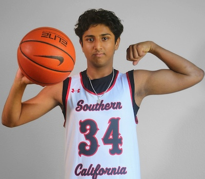

# Arhaan Memon: A Rising Star in Tech and Sports

Ever met someone who can seamlessly balance their passion for sports and cutting-edge technology? Meet **Arhaan Memon**, a 10th grader with a love for **basketball** and a keen interest in **computer science** and **data analytics**. Whether he's on the court or coding the next big app, Arhaan is always striving for excellence.

With an eye on the future, Arhaan’s combination of athletic drive and technical prowess makes him stand out. As a player for his high school basketball team, he’s learned discipline and teamwork, both of which he applies to his coding projects. Arhaan dreams of merging his love for sports and tech to revolutionize the game through data analytics. [Learn more about how data analytics is transforming sports](https://www.analyticsvidhya.com/blog/2021/10/data-analytics-in-sports-how-it-is-changing-the-game/).

Curious about how technology is changing the future of basketball? Read this article on [emerging tech in sports](https://www.nba.com/news/how-technology-is-changing-the-future-of-basketball) to see how Arhaan’s vision might shape the game.

<!-- This grid_container class is for the CSS styling, the id is for JavaScript connection -->

# Places I Like

    <!-- content will be added here by JavaScript -->

# My journey so far....

  
   
  <button id="prev-btn">Previous</button>
  <button id="next-btn">Next</button>

# Star Performances

<iframe width="560" height="315" src="https://www.youtube.com/embed/H-LcQApiDPs?si=Fs4qNbc2NrPilHFV" title="YouTube video player" frameborder="0" allow="accelerometer; autoplay; clipboard-write; encrypted-media; gyroscope; picture-in-picture; web-share" referrerpolicy="strict-origin-when-cross-origin" allowfullscreen></iframe>

